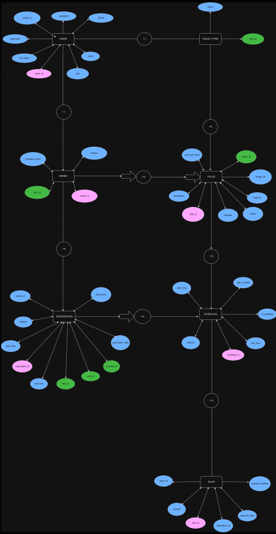
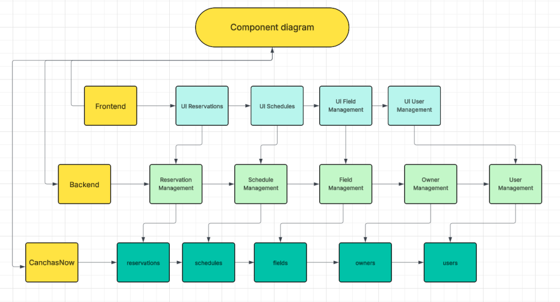
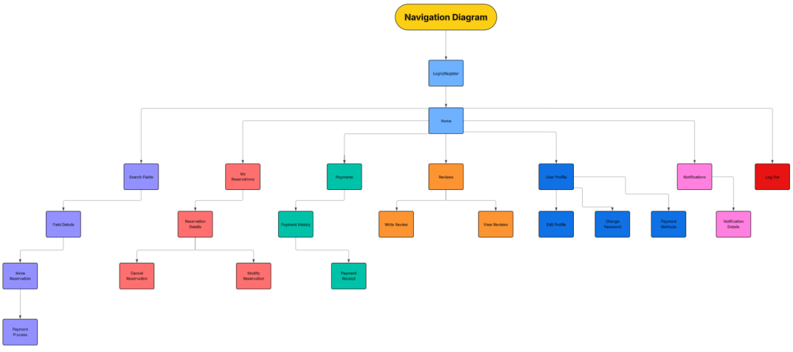

# 🏟️ CanchasNow  

Welcome to **CanchasNow** 🎉  
A web platform for booking sports courts in Barranquilla, Colombia. It allows **users** to search and book courts, **owners** to manage their courts, and **admins/developers** to oversee the system.  

---

## 📑 Table of Contents  
- [Description](#description)  
- [Features](#features)  
- [Technologies](#technologies)  
- [Installation & Usage](#installation--usage)  
- [Project Structure](#project-structure)  
- [ER Model](#er-model)  
- [Contributing](#contributing)  
- [License](#license)  

---

## 📖 Description  

CanchasNow is a **multi-page web app (MPA)** developed as an academic project.  

It provides:  
- An easy way for **users** to view schedules, prices, and book courts.  
- A panel for **owners** to manage their uploaded courts, update details, and add new ones.  
- An **admin/developer** role that creates owner accounts (email and password).  

---

## 🚀 Features  

### 👤 Users  
- Registration and login.  
- Search and book courts.  
- View schedules, prices, and gallery.  
- Online payments (PayPal, Credit Card, Google Pay, Apple Pay).  

### 🏠 Owners  
- Register/login and manage their courts.  
- Add, edit, or delete court information.  
- Subscription system → first 2 courts free, from the 3rd court a monthly plan is required.  

### 👨‍💻 Admins/Developers  
- Create accounts for owners (with email & password).  
- Manage system data and subscriptions.  

---

## 🛠️ Technologies  

- **Frontend:** HTML, CSS (Tailwind + custom), Vanilla JavaScript  
- **Backend:** Node.js, Express  
- **Database:** MySQL (via MySQL Workbench)  
- **Authentication:** JWT  
- **Other tools:** Postman (for API testing), LocalStorage/SessionStorage for sessions  

---

## ⚙️ Installation & Usage  

### Requirements  
- **Node.js >= 14**  
- **MySQL (Workbench)**  

### Steps  

1. Clone the repository:  
   ```bash
   git clone https://github.com/DieguitoCoder/Proyect-CanchasNow.git
   cd Proyect-CanchasNow
   ```

2. Install backend dependencies:  
   ```bash
   cd backend
   npm install
   ```

3. Set up the database:  
   - Open **MySQL Workbench**.  
   - Create a database and run the scripts in `backend/sql/` (e.g., `schema.sql`).  
   - Update your database credentials in `backend/db.js`.  

4. Start the backend server:  
   ```bash
   npm start
   ```

5. Open the frontend:  
   - Navigate to `frontend/src/views/website/`.  
   - Right-click on `index.html` and open it with **Live Server** (or directly in your browser).  

---

## 📂 Project Structure  

```
CanchasNow/
├── backend/
│   ├── db.js              # Database connection (MySQL)
│   ├── server.js          # Entry point for backend
│   ├── routes/            # API routes
│   ├── middleware/        # Auth & other middlewares
│   ├── sql/               # SQL scripts (schema, inserts, etc.)
│   └── package.json
├── frontend/
│   ├── src/
│   │   ├── views/         # HTML views (website pages)
│   │   ├── js/            # JavaScript scripts
│   │   ├── css/           # Tailwind & custom styles
│   │   ├── assets/        # Images & icons
│   │   ├── courts/        # Court-related pages
│   │   └── data/          # Static data
└── README.md
```  

---

## 📊 ER Model  

Entity-Relationship and diagrams used in this project:  

### ER Diagram  
  

### Component Diagram  
  

### Navigation Diagram  
  

---

## 🤝 Contributing  

Contributions are welcome!  
1. Fork the repo.  
2. Create your branch:  
   ```bash
   git checkout -b feature/new-feature
   ```  
3. Commit your changes:  
   ```bash
   git commit -m "Add new feature"
   ```  
4. Push to your branch:  
   ```bash
   git push origin feature/new-feature
   ```  
5. Open a Pull Request.  

---

## 📜 License  

This project is licensed under the **MIT License**.  
See the [LICENSE](LICENSE) file for more details.  

---


## Team

[]()

## Members
[]()
[]()
[]()
[]()
[]()
